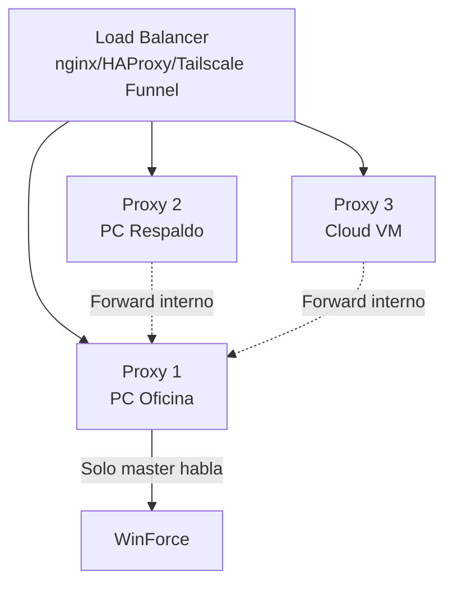

# Escalabilidad - Guía para Futuros Programadores

> **LEER ESTO PRIMERO** si estás retomando el proyecto o te unes al equipo.
> Este documento explica el camino preparado para que la app escale de 20 agentes LAN a N agentes remotos.

---

## Resumen Ejecutivo (30 segundos)

| Hoy (2026-08-25) | Futuro (Cuando pidan remoto) |
|------------------|------------------------------|
| 20 agentes en LAN oficina | N agentes en campo / home office |
| 1 proxy en PC fija oficina | Mismo proxy + **Tailscale VPN** |
| Token compartido LAN | **Mismo token** funciona via VPN |
| Owner rota credenciales via RDP | Owner rota via **VPN + endpoint `/admin/rotar`** |
| Config manual por agente | **Auto-discovery** via `GET /admin/config` |

**No hay que reescribir nada**. La arquitectura ya está preparada. Solo activar VPN y configurar DNS.

---

## El Camino Preparado (Lo Que Ya Existe)

### 1. Proxy Stateless (salvo sesión WinForce)
- `validator_app/proxy/server.py` — FastAPI, sin estado local
- Cookies de sesión en **Windows Keyring** (`JSWinProxy`/`credentials`) → sobreviven a reinicios
- Múltiples instancias de proxy posibles detrás de load balancer (sticky sessions)

### 2. Auth Simple pero Escalable
- **Token compartido** (256-bit hex) → un solo secreto para todos los agentes
- **Admin key separada** → solo owner, para endpoints `/admin/*`
- **IP binding** → `allowed_networks: ["192.168.0.0/16", "10.0.0.0/8", "172.16.0.0/12"]` → **incluye rango Tailscale `100.64.0.0/10`**

### 3. Endpoint de Auto-Discovery (Ya Implementado)
```http
GET /admin/config  →  {proxy_url, token, timeouts, version}
```
- Sin auth (solo accesible en LAN/VPN)
- `ProxyClient.from_discovery()` listo en `validator_app/proxy/client.py`

### 4. Cliente Proxy con Retries y Timeouts
```python
ProxyClient(base_url, token, timeout=30)
  .validar_cobertura(lat, lon)
  .validar_score(tipo, num, lat, lon, cobertura)
  .health_check()
  # Retries: 3x backoff (1s, 2s, 4s)
  # Errores tipados: ConnectionError, AuthError, ServerError, TimeoutError
```

### 5. Servicio Windows (winsw) — Produccion-Ready
- Auto-inicio sin login
- Auto-restart si crashea
- Logs en Visor de Eventos
- Gestionable remoto: `sc \\PC command`

---

## Cómo Activar Escalabilidad Remota (Checklist 1 Hora)

### Paso 1: Tailscale en PC Proxy (5 min)
```powershell
# En PC proxy como Admin
winget install Tailscale.Tailscale
# Login con cuenta empresa → anota IP Tailscale (ej: 100.64.12.34)
```

### Paso 2: Tailscale en Laptops Remotas (1 min c/u)
```powershell
# En cada laptop (usuario normal, sin Admin)
winget install Tailscale.Tailscale
# Login con misma cuenta empresa → se une a la tailnet auto
```

### Paso 3: Verificar (2 min)
```powershell
# Desde laptop remota
curl http://100.64.12.34:8080/health
# {"status":"ok","logged_in":true,...}
```

### Paso 4: Configurar Agentes Remotos (Igual que LAN)
- IP: `100.64.12.34:8080` (IP Tailscale del proxy)
- Token: **El mismo** que agentes LAN
- GUI: ⚙️ Configuración → Configurar Proxy → pegar IP + token → Probar → Guardar

### Paso 5: (Opcional) DNS Interno para Auto-Discovery
- En Tailscale admin console → DNS → añadir `proxy.oficina.local` → `100.64.12.34`
- Agentes usan `ProxyClient.from_discovery()` → se configuran solos

---

## Lo Que NO Hay Que Tocar (Ya Funciona)

| Componente | Por Qué No Tocar |
|------------|------------------|
| `validator_app/core/api.py` | Lógica de negocio WinForce/Equifax — independiente del transporte |
| `validator_app/gui/main_window.py` | Ya usa `ProxyClient` si hay config, sino `ValidatorAPI` directo |
| `validator_app/activation/` | Licencias RSA por máquina — ortogonales al proxy |
| Token compartido | Funciona igual en LAN y VPN (mismo secreto) |

---

## Lo Que SÍ Hay Que Hacer (Cuando Pidan)

| Tarea | Archivo | Esfuerzo |
|-------|---------|----------|
| Habilitar HTTPS en proxy | `server.py` + `uvicorn --ssl-keyfile --ssl-certfile` | 30 min |
| Certificado self-signed para LAN/VPN | `mkcert` o `openssl` | 10 min |
| Documentar en `README_PROXY.md` sección "Agentes Remotos" | `README_PROXY.md` | 15 min |
| Probar con 1 laptop real | — | 30 min |

---

## Arquitectura Futura (Multi-Proxy HA)

Cuando la carga supere ~100 agentes o quieran redundancia:



- **Solo 1 proxy "master" habla con WinForce** (evita problemas de sesión múltiple)
- Réplicas hacen forward interno al master
- Token compartido igual en todos
- Sticky sessions en LB (cookie `PHPSESSID`)

---

## Decisiones Que Ya Tomamos (Para Que No Las Revisen)

| Decisión | Alternativa Descartada | Por Qué |
|----------|------------------------|---------|
| **VPN (Tailscale)** | AnyDesk, Ngrok, VPS público | Gratis ≤100 devices, zero-config, mesh auto, seguro |
| **Token único compartido** | API key por máquina | Simplicidad operativa; rotación = 1 vez en proxy + redistribuir |
| **Proxy local (no cloud)** | API pública en AWS/Azure | Costo $0, credenciales nunca salen de la oficina, offline-first |
| **winsw service** | systemd, NSSM, Task Scheduler | Nativo Windows, logs eventos, auto-restart, `sc` remoto |
| **config.yaml gitignored** | Env vars / Azure Key Vault | Simple, portable, owner lo ve y controla |

---

## Referencias Rápidas

| Documento | Qué Contiene |
|-----------|--------------|
| `docs/arquitectura.md` | Diagrama Mermaid + decisiones clave + flujo datos |
| `docs/proxy-deploy.md` | Instalación paso a paso PC proxy |
| `docs/proxy-config.md` | Configuración agentes (GUI + script) |
| `docs/rotacion-credenciales.md` | Proceso rotación WinForce (RDP v1 → VPN v2) |
| `docs/escalabilidad-remota.md` | Este documento en detalle + multi-proxy |
| `validator_app/proxy/client.py` | `ProxyClient.from_discovery()` |
| `validator_app/proxy/server.py` | `GET /admin/config` + middleware auth |
| `anotaciones.md` | Glosario términos técnicos |

---

## Mensaje para el Gerente / Stakeholder

> **"La arquitectura ya soporta agentes remotos. No hay que reprogramar nada. Solo instalar Tailscale (gratis, 1-click) en la PC de la oficina y en las laptops de los vendedores. Toma ~1 hora para 10 laptops. Costo: $0."**

---

## Contacto / Historial

- **Decisión original**: 2026-08-25 (sesión documentada en `ResumenDelDia.md`)
- **Arquitecto**: [Tu nombre / equipo]
- **Próxima revisión**: Cuando pidan primer agente remoto
- **Issue tracker**: GitHub Issues del repo