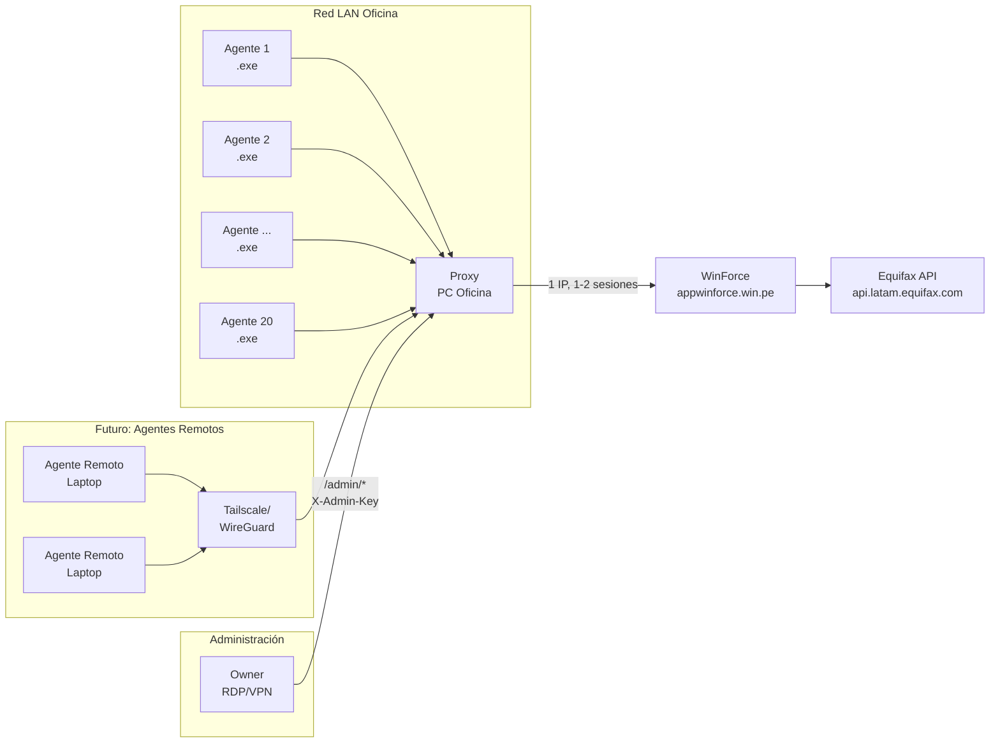

# Arquitectura del Sistema

> Documento técnico permanente. No cambiar sin análisis de impacto.

---

## Diagrama General



---

## Componentes

### Agentes (20 máquinas LAN)
- **Ejecutable**: `JSConnect-Win-Coverage.exe` (PyInstaller, portable)
- **Comunicación**: HTTP POST a `http://<proxy-ip>:8080/api/cobertura` y `/api/score`
- **Autenticación**: Header `X-Proxy-Token` (token compartido)
- **Configuración**: IP:puerto proxy + token guardados en **Windows Keyring** (`JSWinClient`/`proxy_token`)
- **Modo standalone**: Si no hay config proxy → usa `validator_app.core.api` directo (desarrollo/pruebas)

### Proxy Server (PC Oficina - única máquina)
- **Proceso**: `uvicorn server:app --host 0.0.0.0 --port 8080` envuelto en **winsw service** (`JSWinProxy`)
- **Framework**: FastAPI (async, concurrencia nativa)
- **Estado**: Stateless salvo sesión WinForce en memoria + cookies persistidas en keyring
- **Endpoints**:
  - `POST /api/cobertura` — Valida coordenadas contra WinForce
  - `POST /api/score` — Consulta score crediticio (DNI/RUC/CE)
  - `GET /health` — Health check + info sesión
  - `GET /admin/config` — Auto-discovery para agentes futuros (proxy_url, token, timeouts)
  - `POST /admin/login` — Owner inicia sesión en WinForce (via RDP)
  - `POST /admin/rotar` — Owner rota credenciales WinForce (via RDP/VPN)
  - `GET /admin/status` — Estado sesión proxy
- **Autenticación**:
  - `/api/*`: `X-Proxy-Token` + IP en rangos LAN permitidos
  - `/admin/*`: `X-Admin-Key` (solo owner)
- **Persistencia**: Cookies de sesión WinForce en **Windows Keyring** (`JSWinProxy`/`credentials`) → sobreviven a reinicios del servicio

### WinForce (Sistema externo ISP)
- **Base URL**: `https://appwinforce.win.pe`
- **Login**: `POST /controllers/acceso.php` → cookie `PHPSESSID` + **redirige a Microsoft 2FA**
- **Cobertura**: `GET /controllers/coordenada.php?accion=validar_cobertura`
- **Score**: `POST /controllers/cliente.php` con `accion=score_cliente` → reporte SOAP Equifax doble-encodificado
- **Límites**: 2-3 sesiones concurrentes por cuenta; timeout 3 min inactividad; rotación credenciales cada 1-2 meses

### Equifax (API externa crediticia)
- **OAuth**: `client_credentials` (credenciales embebidas en JS del sitio WinForce)
- **Endpoints**: `coordinates`, `coordinates-ref`, `intersectz`, `capas` (geodata: distrito, ubigeo, cod_postal, segmentación)
- **Nota**: El proxy **NO replica geocoding Equifax**; el payload `score_cliente` envía campos geodata vacíos (el servidor los rellena o no son obligatorios). Ver `validator_app/core/api.py:141-151`.

---

## Flujo de Datos Detallado

### Validación Cobertura
```
Agente                    Proxy                        WinForce
  │                         │                            │
  ├─ POST /api/cobertura──►│                            │
  │  {lat, lon}            │                            │
  │  X-Proxy-Token         │                            │
  │                        ├─ GET /coordenada.php ─────►│
  │                        │  accion=validar_cobertura   │
  │                        │  data[latitud], data[long]  │
  │                        │  Cookie: PHPSESSID          │
  │                        ◄──── {cobertura: SI, tipo...}│
  ◄──── {hay_cobertura: true,                            │
  │      cobertura: "SI", tipo: "HORIZONTAL",           │
  │      id_celda: "9754"}                               │
```

### Validación Score
```
Agente                    Proxy                        WinForce              Equifax
  │                         │                            │                    │
  ├─ POST /api/score ─────►│                            │                    │
  │  {tipo_doc, num_doc,   │                            │                    │
  │   lat, lon, cobertura} │                            │                    │
  │                        ├─ POST /cliente.php ────────►│                    │
  │                        │  accion=score_cliente       │                    │
  │                        │  data[tipo_doc]=1           │                    │
  │                        │  data[documento_identidad]  │                    │
  │                        │  data[latitud], [longitud]  │                    │
  │                        │  data[serv_cobertura]=SI    │                    │
  │                        │  + 25 campos geodata vacíos │                    │
  │                        │◄──── {response:success,      │                    │
  │                        │       data: "<JSON-SOAP>"}  │                    │
  │                        │         (parsea SOAP)       │                    │
  │                        │         Puntaje: 423        │                    │
  │                        │         NivelRiesgo: ALTO   │                    │
  │                        │         DeudaTotal: 15000   │                    │
  ◄──── {valor: 423, riesgo: "MUY ALTO",                │                    │
  │      conclusion: "NO APTO", deuda_total: 15000,     │                    │
  │      nombre: "JUAN PEREZ", documento: "75020496"}   │                    │
```

---

## Decisiones Arquitectónicas Clave (No Cambiar Sin Análisis)

| # | Decisión | Rationale | Impacto si cambia |
|---|----------|-----------|-------------------|
| 1 | **Proxy = Stateless** (salvo sesión WinForce) | Permite múltiples proxies detrás de load balancer futuro | Requiere session store compartido (Redis) |
| 2 | **Token único compartido** (no por máquina) | Simplicidad operativa; seguridad por LAN + VPN | Si se filtra token → rotar en proxy + redistribuir a 20 agentes |
| 3 | **FastAPI + uvicorn** (no stdlib) | Concurrencia real, validación automática, docs Swagger | Más deps (+~10MB .exe proxy), pero cero bugs de concurrencia |
| 4 | **config.yaml gitignored** + `config.yaml.example` en repo | Cero secretos en GitHub público | Owner debe generar config.yaml en instalación |
| 5 | **Requirements separados** (`requirements-proxy.txt`) | .exe agentes no arrastra fastapi/uvicorn | Dos archivos requirements; documentado en README_PROXY.md |
| 6 | **Endpoints `/admin/*` preparados** para v2 remota | Hoy solo via RDP; futuro VPN + HTTPS | Requiere cert TLS + VPN para exponer seguro |
| 7 | **Auto-relogin silencioso** en proxy (120s idle) | Agentes no ven errores de sesión expirada | Lógica en `ValidatorAPI.auto_relogin_if_needed()` |
| 8 | **Geodata vacíos en score_cliente** | Servidor WinForce los rellena o no son obligatorios | Si WinForce cambia y exige geodata → replicar Equifax OAuth |

---

## Seguridad

| Capa | Mecanismo |
|------|-----------|
| **Red** | Solo LAN (`192.168.0.0/16`, `10.0.0.0/8`, `172.16.0.0/12`); futuros remotos via VPN |
| **Aplicación** | Token compartido 256-bit (hex 64 chars) + Admin key 256-bit separado |
| **Credenciales WinForce** | Solo en keyring de PC proxy (`JSWinProxy`/`credentials`); NUNCA en agentes |
| **Credenciales Equifax** | Solo en JS del sitio WinForce; proxy NO las maneja |
| **Activación agentes** | RSA asimétrica por huella HW (`validator_app/activation/`) — independiente del proxy |
| **Auditoría** | Logs en Visor de Eventos (winsw) + logs estructurados en proxy (JSON) |

---

## Puntos de Extensión Preparados

1. **Rate limiting por máquina**: Middleware listo para header `X-Client-ID`
2. **Métricas Prometheus**: `/metrics` endpoint (descomentar en `server.py`)
3. **Múltiples proxies**: DNS round-robin o load balancer (arquitectura stateless)
4. **HTTPS en LAN**: Self-signed cert + `uvicorn --ssl-keyfile --ssl-certfile`
5. **Auto-discovery agentes**: `GET /admin/config` devuelve `proxy_url`, `token`, `timeouts` para `ProxyClient.from_discovery()`