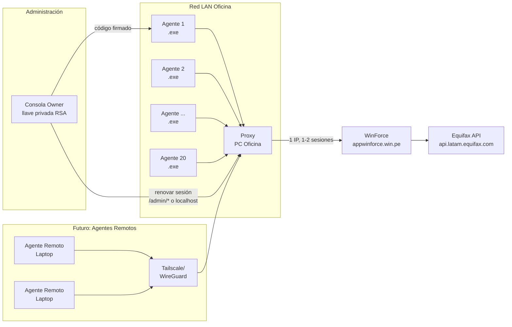

# Arquitectura del Sistema

> Documento técnico permanente. No cambiar sin análisis de impacto.

---

## Diagrama General



---

## Componentes

### Agentes (20 máquinas LAN)
- **Ejecutable**: `JSConnect-Win-Coverage.exe` (PyInstaller, portable)
- **Comunicación**: HTTP POST a `http://<proxy-ip>:8080/api/cobertura` y `/api/score`
- **Autenticación**: Header `X-Proxy-Token` (token compartido)
- **Configuración**: IP:puerto proxy + token guardados en **Windows Keyring** (`JSWinClient`/`proxy_token`)
- **Modo standalone**: Si no hay config proxy → usa `validator_app.core.api` directo (desarrollo/pruebas)

### Consola del owner (estación autorizada)
- **Ejecutable**: `JSConnect-Win-Owner.exe`, separado del agente
- **Activación**: firma la huella exacta del agente con `private_key.pem`; el
  agente verifica el código con la llave pública embebida
- **Operación**: consulta el servicio/proxy local y abre la renovación asistida
  de WinForce
- **Límite de seguridad**: la llave privada nunca entra en Git ni en el ejecutable
  del agente. En un build empaquetado vive junto al ejecutable owner, protegida
  por ACL NTFS

### Proxy Server (PC Oficina - única máquina)
- **Proceso**: `python -m validator_app.proxy.server` envuelto en **winsw service** (`JSWinProxy`); host y puerto salen de `ProxyConfig` (`validator_app/proxy/install_service.bat`)
- **Framework**: FastAPI (async, concurrencia nativa)
- **Estado**: Stateless salvo sesión WinForce en memoria + cookies persistidas en keyring
- **Endpoints**:
  - `POST /api/cobertura` — Valida coordenadas contra WinForce
  - `POST /api/score` — Consulta score crediticio (DNI/RUC/CE)
  - `GET /health` — Health check + info sesión
  - `GET /admin/config` — Configuración protegida por `X-Admin-Key`; incluye token
  - `POST /admin/login` — Owner inyecta la cookie `PHPSESSID` obtenida de un login manual en navegador (via RDP)
  - `POST /admin/rotar` — Owner rota la cookie `PHPSESSID` (via RDP/VPN); idéntico a `/admin/login`
  - **Nota**: el login programático (usuario/password) es inviable — WinForce redirige a Microsoft 2FA. La cookie `PHPSESSID` se obtiene siempre de un login manual en navegador y se inyecta por estos endpoints o con `tools/probar_con_cookie.py` / `validator_app/proxy/rotate_creds.py`.
  - `GET /admin/status` — Estado sesión proxy + bloque `keepalive` (`enabled`, `last_ping_at`, `last_ping_ok`, `consecutive_failures`, `session_dead_since`)
- **Keepalive ("latido perezoso")**: un loop `asyncio` en el `lifespan` pinga
  `validar_cobertura` (coordenada pública rotada) cada `keepalive_interval_seconds`
  (**900s**), **pero solo si no hubo tráfico real de los agentes en ese intervalo**
  (`ProxyValidatorAPI._last_activity`). Con 20 agentes el trabajo normal ya
  mantiene la sesión; el ping cubre los huecos (almuerzo, primera hora). Si un
  ping falla, se confirma contra WinForce con `validar_cookie_sesion()`: fallo del
  endpoint → transitorio; sesión muerta → `log.error` con **aviso al owner** +
  `session_dead_since` en `/admin/status`, **sin reintentar en silencio**. El
  keepalive vence al idle-timeout (~20 min) pero **no** al tope absoluto de sesión
  ≈ 9.5 h desde el login (ahí el owner renueva la cookie ~1 vez por jornada;
  re-login programático inviable por 2FA). Config: `keepalive_enabled`,
  `keepalive_interval_seconds`.
- **Autenticación**:
  - `/api/*`: `X-Proxy-Token` + IP en rangos LAN permitidos (loopback siempre)
  - `/admin/*`: `X-Admin-Key` + **solo desde 127.0.0.1** (no viaja por LAN: el admin
    key expone el `proxy_token` vía `/admin/config`, así que nunca se acepta remoto)
  - Detalle y FAQ en "Control de acceso al proxy" (abajo)
- **Persistencia**: Cookies de sesión WinForce en **Windows Keyring** (`JSWinProxy`/`credentials_cookies`) → sobreviven a reinicios del servicio

### WinForce (Sistema externo ISP)
- **Base URL**: `https://appwinforce.win.pe`
- **Login**: `POST /controllers/acceso.php` → cookie `PHPSESSID` + **redirige a Microsoft 2FA**
- **Cobertura**: `GET /controllers/coordenada.php?accion=validar_cobertura`
- **Score**: `POST /controllers/cliente.php` con `accion=score_cliente` → reporte SOAP Equifax doble-encodificado
- **Límites**: 2-3 sesiones concurrentes por cuenta; timeout 3 min inactividad; rotación credenciales cada 1-2 meses

### Equifax (API externa crediticia)
- **OAuth**: `client_credentials` (credenciales embebidas en JS del sitio WinForce)
- **Endpoints**: `coordinates`, `coordinates-ref`, `intersectz`, `capas` (geodata: distrito, ubigeo, cod_postal, segmentación)
- **Nota**: El proxy **NO replica geocoding Equifax**; el payload `score_cliente` envía campos geodata vacíos (el servidor los rellena o no son obligatorios). Ver `validator_app/core/api.py:141-151`.

---

## Flujo de Datos Detallado

### Validación Cobertura
```
Agente                    Proxy                        WinForce
  │                         │                            │
  ├─ POST /api/cobertura──►│                            │
  │  {lat, lon}            │                            │
  │  X-Proxy-Token         │                            │
  │                        ├─ GET /coordenada.php ─────►│
  │                        │  accion=validar_cobertura   │
  │                        │  data[latitud], data[long]  │
  │                        │  Cookie: PHPSESSID          │
  │                        ◄──── {cobertura: SI, tipo...}│
  ◄──── {hay_cobertura: true,                            │
  │      cobertura: "SI", tipo: "HORIZONTAL",           │
  │      id_celda: "9754"}                               │
```

### Validación Score
```
Agente                    Proxy                        WinForce              Equifax
  │                         │                            │                    │
  ├─ POST /api/score ─────►│                            │                    │
  │  {tipo_doc, num_doc,   │                            │                    │
  │   lat, lon, cobertura} │                            │                    │
  │                        ├─ POST /cliente.php ────────►│                    │
  │                        │  accion=score_cliente       │                    │
  │                        │  data[tipo_doc]=1           │                    │
  │                        │  data[documento_identidad]  │                    │
  │                        │  data[latitud], [longitud]  │                    │
  │                        │  data[serv_cobertura]=SI    │                    │
  │                        │  + 25 campos geodata vacíos │                    │
  │                        │◄──── {response:success,      │                    │
  │                        │       data: "<JSON-SOAP>"}  │                    │
  │                        │         (parsea SOAP)       │                    │
  │                        │         Puntaje: 423        │                    │
  │                        │         NivelRiesgo: ALTO   │                    │
  │                        │         DeudaTotal: 15000   │                    │
  ◄──── {valor: 423, riesgo: "MUY ALTO",                │                    │
  │      conclusion: "NO APTO", deuda_total: 15000,     │                    │
  │      nombre: "JUAN PEREZ", documento: "75020496"}   │                    │
```

---

## Decisiones Arquitectónicas Clave (No Cambiar Sin Análisis)

| # | Decisión | Rationale | Impacto si cambia |
|---|----------|-----------|-------------------|
| 1 | **Proxy = Stateless** (salvo sesión WinForce) | Permite múltiples proxies detrás de load balancer futuro | Requiere session store compartido (Redis) |
| 2 | **Token único compartido** (no por máquina) | Simplicidad operativa; seguridad por LAN + VPN | Si se filtra token → rotar en proxy + redistribuir a 20 agentes |
| 3 | **FastAPI + uvicorn** (no stdlib) | Concurrencia real, validación automática, docs Swagger | Más deps (+~10MB .exe proxy), pero cero bugs de concurrencia |
| 4 | **config.yaml gitignored** + `config.yaml.example` en repo | Cero secretos en GitHub público | Owner debe generar config.yaml en instalación |
| 5 | **Requirements separados** (`requirements-proxy.txt`) | .exe agentes no arrastra fastapi/uvicorn | Dos archivos requirements; documentado en README_PROXY.md |
| 6 | **Endpoints `/admin/*` preparados** para v2 remota | Hoy solo via RDP; futuro VPN + HTTPS | Requiere cert TLS + VPN para exponer seguro |
| 7 | **Auto-recuperación de sesión** en proxy (120s idle) | Agentes no ven errores de sesión expirada mientras la cookie del keyring siga viva | Lógica en `ProxyValidatorAPI.auto_relogin_if_needed()` / `_relogin_silent()` (`server.py`); revalida la última `PHPSESSID` del keyring y **deja rastro en el log** de cada fallo (cookie expirada vs. fallo de red) |
| 8 | **Geodata vacíos en score_cliente** | Servidor WinForce los rellena o no son obligatorios | Si WinForce cambia y exige geodata → replicar Equifax OAuth |
| 9 | **Keepalive "latido perezoso"** (ping solo tras N min sin tráfico real) | Mantiene la sesión viva en huecos sin martillear la cuenta de Win con consultas fantasma | `_keepalive_loop` / `ProxyValidatorAPI._keepalive_tick` (`server.py`). No vence el tope absoluto ≈ 9.5h → aviso al owner, sin re-login programático (2FA) |

---

## Seguridad

| Capa | Mecanismo |
|------|-----------|
| **Red** | Solo LAN (`192.168.0.0/16`, `10.0.0.0/8`, `172.16.0.0/12`); futuros remotos via VPN |
| **Aplicación** | Token compartido 256-bit (hex 64 chars) + Admin key 256-bit separado |
| **Sesión WinForce** | Cookie `PHPSESSID` solo en keyring de PC proxy (`JSWinProxy`/`credentials_cookies`); NUNCA en agentes |
| **Credenciales Equifax** | Solo en JS del sitio WinForce; proxy NO las maneja |
| **Activación agentes** | RSA asimétrica por huella HW (`validator_app/activation/`) — independiente del proxy |
| **Llave de activación** | Pública embebida en agentes; privada solo en la estación owner, fuera de Git |
| **Auditoría** | Salida de WinSW en `<repo>\logs\`; eventos 101/102 para alertas de sesión |

---

## Puntos de Extensión Preparados

1. **Rate limiting por máquina**: Middleware listo para header `X-Client-ID`
2. **Métricas Prometheus**: `/metrics` endpoint (descomentar en `server.py`)
3. **Múltiples proxies**: DNS round-robin o load balancer (arquitectura stateless)
4. **HTTPS en LAN**: Self-signed cert + `uvicorn --ssl-keyfile --ssl-certfile`
5. **Provisionamiento administrado**: `GET /admin/config` devuelve `proxy_url`,
   `token`, `timeouts` con `X-Admin-Key`; no debe exponerse como discovery público

---

## Control de acceso al proxy

`/api/*` exige **dos cosas**: (1) que la IP de origen esté en `allowed_networks`
(o sea loopback, que siempre se permite) y (2) el header `X-Proxy-Token`.
`/admin/*` exige `X-Admin-Key` **y** que la petición venga de `127.0.0.1` — a
diferencia de `/api/*`, esto no es configurable vía `allowed_networks`: el admin
key da acceso total (incluye el `proxy_token` vía `/admin/config`), así que nunca
se acepta desde la LAN, aunque la IP esté en los rangos permitidos. La consola
owner (`JSConnect-Win-Owner.exe`) y `rotate_creds.py` siempre corren en la misma
PC que el proxy, así que no dependen de acceso remoto a `/admin/*`.
`/health` es público (solo estado, sin datos).
Por defecto el instalador permite `192.168.0.0/16`, `10.0.0.0/8`, `172.16.0.0/12` y
`100.64.0.0/10` (Tailscale) para `/api/*` — **el sistema no es de acceso público**.

- **Error "IP no permitida: <ip>" (HTTP 403)**: la IP que aparece en el mensaje es la
  que ve el proxy. Si es la de la propia PC del proxy usada como agente
  (`http://localhost:8080`) ya no ocurre: loopback siempre pasa. Si es una IP legítima
  fuera de los rangos, añade su CIDR a `allowed_networks` en
  `validator_app/proxy/config.yaml` (como Administrador) y ejecuta
  `Restart-Service JSWinProxy` (o el botón **Reiniciar servicio** de la consola
  owner, que pide permiso UAC). El servicio carga código y `config.yaml` solo al
  arrancar: sin reiniciar, un arreglo no se aplica (caso real del 2026-09-18: el
  fix de loopback no surtió efecto hasta reiniciar).
- **Las IP públicas del router de la oficina (p. ej. `162.120.185.241`,
  `38.253.147.12`, `72.14.201.203`) NO se agregan.** Dentro de la LAN el proxy ve la
  IP privada del agente (192.168.x.x), ya permitida. Esas IP públicas son la salida
  NAT hacia Internet, que solo ven WinForce/Equifax. Agregarlas solo tendría efecto
  con el puerto 8080 expuesto a Internet, que está prohibido.
- **Agentes remotos por VPN** (futuro): con Tailscale llegan con IP `100.64.0.0/10`,
  ya permitida: cero cambios. Con otra VPN (WireGuard/OpenVPN propia) o un subnet
  router, añadir a `allowed_networks` el rango de origen que vea el proxy.
- Para endurecer la LAN (p. ej. solo `192.168.18.0/24`), reemplazar la lista en
  `config.yaml` y reiniciar el servicio.
